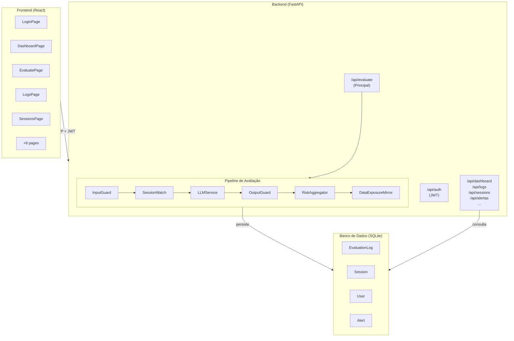
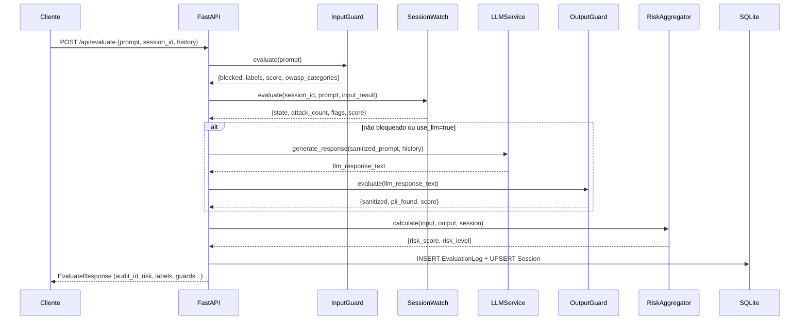
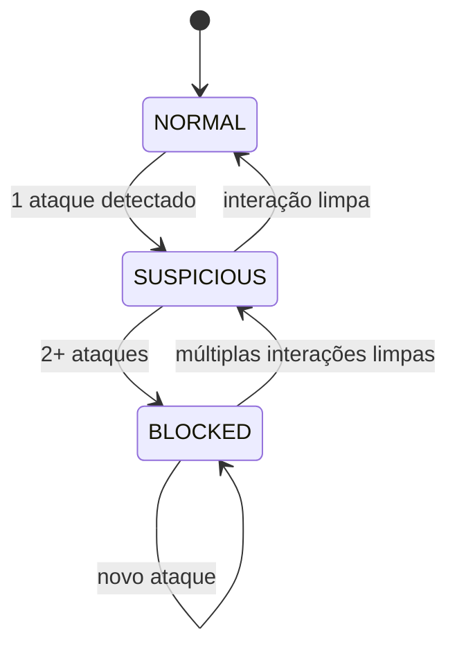

# 02 — Arquitetura e Módulos

> **Documento:** Descrição técnica real da arquitetura implementada

---

## Visão Geral da Arquitetura

O Phoenix é uma aplicação web de três camadas:

```
┌─────────────────────────────────────────────────────────────┐
│                    CLIENTE / BROWSER                        │
│             React 18 + Vite 5 + Tailwind CSS                │
└─────────────────────────┬───────────────────────────────────┘
                          │ HTTP / WebSocket
                          ▼
┌─────────────────────────────────────────────────────────────┐
│               BACKEND  (FastAPI + Python 3.12)              │
│                                                             │
│   Auth (JWT)  →  Pipeline de Avaliação  →  Persistência    │
│                                                             │
│   InputGuard │ OutputGuard │ SessionWatch │ RiskAggregator  │
└─────────────────────────┬───────────────────────────────────┘
                          │ SQLAlchemy async
                          ▼
┌─────────────────────────────────────────────────────────────┐
│              BANCO DE DADOS (SQLite / aiosqlite)            │
│   EvaluationLog │ Session │ User │ Alert │ Policy │ ...     │
└─────────────────────────────────────────────────────────────┘
```

Em staging (Docker), um **nginx** atua como reverse proxy à frente de tudo:

```
Internet → nginx:80 → /api/* → phoenix-backend:8000
                    → /ws/*  → phoenix-backend:8000
                    → /      → phoenix-frontend:80
```

---

## Diagrama Mermaid — Componentes do Sistema



---

## Fluxo Principal de Avaliação (`POST /api/evaluate`)



---

## Módulos do Backend

### `services/input_guard.py` — InputGuard

**O que faz:** Analisa o prompt de entrada contra padrões de ataque conhecidos.  
**Tecnologia:** Regex puro (`re` module) — sem modelo de ML.  
**9 categorias de ataque detectadas:**

| Categoria | OWASP | Peso |
|-----------|-------|------|
| `prompt_injection` | LLM01 | 0.90 |
| `jailbreak` | LLM01 | 0.95 |
| `goal_hijacking` | LLM01 | 0.85 |
| `data_exfiltration` | LLM06 | 0.85 |
| `obfuscation` | LLM01 | 0.75 |
| `policy_evasion` | LLM01 | 0.80 |
| `multi_step_deception` | LLM01 | 0.70 |
| `tool_abuse` | LLM08 | 0.85 |
| `context_hijacking` | LLM01 | 0.75 |

**Output:**
```python
{
  "blocked": bool,
  "labels": List[str],          # categorias detectadas
  "score": float,               # 0–100
  "policy_hits": List[str],     # descrição das políticas violadas
  "sanitized_prompt": str,      # prompt com tokens perigosos marcados
  "owasp_categories": List[str] # ex.: ["LLM01:PromptInjection"]
}
```

**Limitação real:** regex não captura ataques semânticos sofisticados ou em idiomas não cobertos pelos padrões.

---

### `services/output_guard.py` — OutputGuard

**O que faz:** Analisa a resposta do LLM, detecta e mascara PII.  
**Tecnologia:** Regex puro — inspirado no Microsoft Presidio, implementação própria.  
**8 tipos de PII detectados:**

| Tipo | Exemplo | Máscara |
|------|---------|---------|
| CPF | 123.456.789-00 | `***.***.***-**` |
| CNPJ | 12.345.678/0001-99 | `**.***.***/***/***-**` |
| Email | user@example.com | `****@****.***` |
| Telefone | (11) 99999-9999 | `(**) *****-****` |
| Cartão de crédito | 4111 1111 1111 1111 | `****-****-****-****` |
| RG | 12.345.678-9 | `**.***.***-*` |
| CEP | 01310-100 | `*****-***` |
| Passaporte / IP | — | mascarados |

**Limitação real:** PII contextual (ex.: "meu número é 12345") não é detectado sem ML.

---

### `services/session_watch.py` — SessionWatch

**O que faz:** Rastreia sessões individualmente e detecta padrões de ataque encadeados.  
**Tecnologia:** Máquina de Estados Finitos (FSM) **em memória** (`threading.Lock`).

**Estados FSM:**



**Flags geradas:**
- `MULTI_ATTACK_PATTERN` — múltiplos ataques em sequência
- `HIGH_FREQUENCY` — muitas requisições em curto período
- `ESCALATING_RISK` — score crescente ao longo da sessão

**Limitação crítica:** o estado FSM é **in-memory**. Um restart do backend zera todas as sessões ativas. O banco tem uma tabela `Session` para persistência de exibição, mas o estado operacional da FSM é perdido no restart.

---

### `services/risk_aggregator.py` — RiskAggregator

**O que faz:** Consolida os scores dos três guards em um único Phoenix Risk Score (0–100).

**Fórmula:**
```
Phoenix Risk Score = (InputGuard × 0.45) + (OutputGuard × 0.30) + (SessionWatch × 0.25)
```

**Níveis de risco:**
| Score | Nível | Cor |
|-------|-------|-----|
| 0–30 | LOW | Verde |
| 30–60 | MEDIUM | Âmbar |
| 60–80 | HIGH | Laranja |
| 80–100 | CRITICAL | Vermelho |

**Nota:** o limiar de bloqueio automático é 75.0 (configurável via `BLOCK_THRESHOLD`).

---

### `services/risk_aggregator.py` — DataExposureMirror

**O que faz:** Analisa o histórico de conversa (`history`) e o prompt atual para mapear quais dados pessoais o usuário já revelou ao LLM — mesmo que não estejam no prompt atual.

**Categorias rastreadas:**
- Dados **explícitos**: PII detectada diretamente no histórico
- Dados **implícitos**: referências a dados anteriores ("meu CPF que eu disse antes")
- `privacy_risk_score`: score de exposição acumulada

**Usado na demo do cenário PII:** usuário fornece CPF no histórico e depois pergunta sobre ele.

---

### `services/llm_service.py` — LLMService

**O que faz:** Abstrai a chamada ao LLM — mock para demo, OpenAI para produção.

| Modo | Config | Comportamento |
|------|--------|---------------|
| `mock` (padrão) | `LLM_PROVIDER=mock` | Resposta aleatória de lista pré-definida; simula latência 50–150ms |
| `openai` | `LLM_PROVIDER=openai` + `OPENAI_API_KEY=sk-...` | Chama `gpt-3.5-turbo` via httpx |

**Limitação real:**
- Modo OpenAI usa hardcoded `gpt-3.5-turbo` — a config `LLM_MODEL=gpt-4o-mini` no `.env` não tem efeito ainda
- Anthropic está na config mas **não implementado** no código — fallback para mock
- Mock responses são genéricas e não refletem o prompt real

---

## Módulos de Rota (Backend)

| Arquivo | Prefixo | Responsabilidade |
|---------|---------|-----------------|
| `routes/auth.py` | `/api/auth` | Login, refresh, perfil |
| `routes/evaluate.py` | `/api/evaluate` | Pipeline principal |
| `routes/analytics.py` | `/api/analytics` | Heatmap, tendências, latência |
| `routes/compliance.py` | `/api/conformidade`, `/api/owasp` | Scores, NIST, LGPD, relatórios |
| `routes/alerts.py` | `/api/alertas` | CRUD alertas, triagem |
| `routes/policies.py` | `/api/politicas` | CRUD políticas |
| `routes/threat_intel.py` | `/api/ameacas` | IOCs, estatísticas |
| `routes/users.py` | `/api/usuarios` | CRUD usuários, API Keys |
| `routes/reports.py` | `/api/relatorios` | Exportação, relatórios |
| `main.py` (inline) | `/api/dashboard`, `/api/sessions`, `/api/logs` | Dashboard, sessões, logs |

---

## Módulos do Frontend

**Stack:** React 18, Vite 5, Tailwind CSS 3, Recharts, Lucide React, Axios

```
frontend/src/
├── App.jsx              ← Roteamento + ProtectedLayout com RBAC
├── hooks/
│   └── useAuth.jsx      ← Context + JWT storage (localStorage)
├── utils/
│   └── api.js           ← axios instance + interceptors (Bearer token)
├── components/
│   └── Sidebar.jsx      ← Navegação + role badge + minRole filtering
└── pages/
    ├── LoginPage.jsx
    ├── DashboardPage.jsx
    ├── EvaluatePage.jsx    ← Data Exposure Mirror visível aqui
    ├── LogsPage.jsx
    ├── SessionsPage.jsx
    ├── AlertasPage.jsx
    ├── ConformidadePage.jsx
    ├── ThreatIntelPage.jsx
    ├── PoliticasPage.jsx
    ├── OWASPPage.jsx
    ├── AnalyticsPage.jsx
    ├── UsuariosPage.jsx
    └── ConfiguracoesPage.jsx
```

---

## Auth e RBAC

**Autenticação:** JWT via `python-jose`  
- Access token: 8 horas  
- Refresh token: 7 dias  
- Armazenado no `localStorage` do browser (`ltf_token`, `ltf_user`)

**3 Roles implementados:**

| Role | Backend | Frontend |
|------|---------|----------|
| `admin` | Acesso total a todos os endpoints | Vê tudo incluindo Usuários |
| `analyst` | Acesso a avaliação e monitoramento | Sem Usuários; com Políticas e Configurações |
| `viewer` | Somente leitura | Sem Usuários, Políticas, Configurações |

**Implementação no frontend:**
- `Sidebar.jsx`: filtra itens de nav por `minRole` (admin rank=3, analyst rank=2, viewer rank=1)
- `App.jsx`: `ProtectedLayout` com `minRole` redireciona para `/dashboard` se rank insuficiente
- Role badge colorido: ADMIN (vermelho), ANALYST (azul), VIEWER (cinza)

---

## Banco de Dados

**Engine:** SQLite + aiosqlite (async)  
**ORM:** SQLAlchemy 2.0 async  

**Tabelas principais:**

| Tabela | Descrição |
|--------|-----------|
| `users` | Usuários, hashed_password, role, avatar_color |
| `evaluation_logs` | Registro completo de cada avaliação |
| `sessions` | Estado de sessão (exibição — FSM real é in-memory) |
| `alerts` | Alertas com status open/acknowledged/resolved |
| `policies` | Regras de bloqueio/alerta configuráveis |
| `threat_intel_entries` | IOCs (Indicators of Compromise) |

**Seed automático no startup:** `lifespan → seed_all()` cria todos os dados de demo se o banco estiver vazio.

---

## WebSocket

**Endpoint:** `ws://HOST/ws/events`  
**Status real:** A infra WebSocket está presente no `main.py` (ConnectionManager, broadcast). O frontend conecta via WebSocket para receber eventos em tempo real.  
**Nota:** O broadcasting de novos eventos de avaliação para o dashboard em tempo real está na infraestrutura mas não é chamado automaticamente a cada `POST /api/evaluate`. O dashboard usa polling HTTP para atualização.
